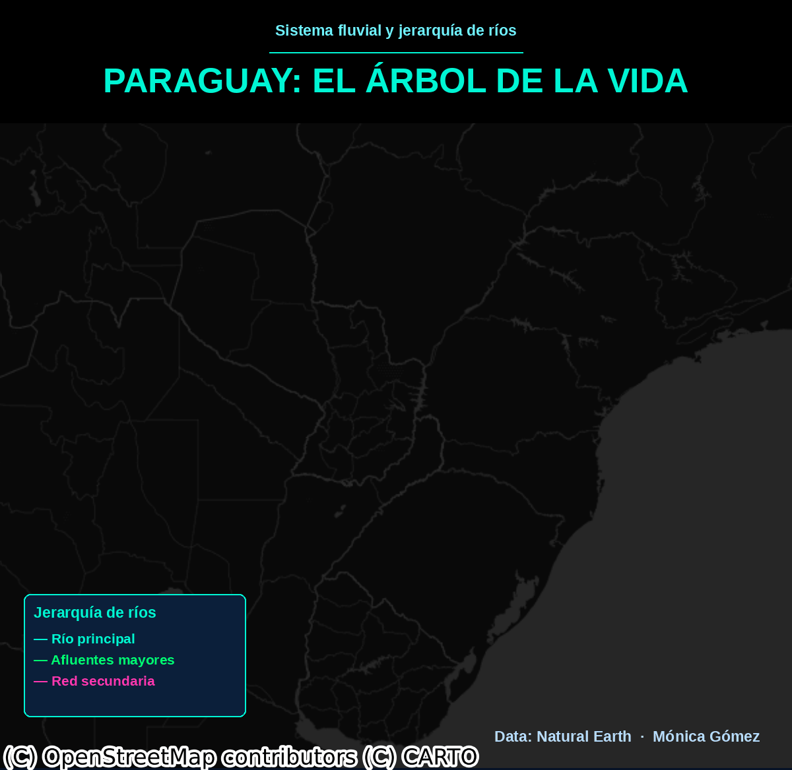

 # 🌿 Paraguay: El Árbol de la Vida

<p align="center">
  
</p>

<p align="center">
  
  
  
</p>

> Visualización cinematográfica de la red fluvial del **Río Paraguay** animada como un árbol de la vida dendrítico, con colores neón jerárquicos sobre fondo cartográfico oscuro.

---

## 📌 Sobre el proyecto

El Río Paraguay atraviesa el país de norte a sur (~2.621 km), define su frontera sur con Argentina y da nombre a la nación. Su cuenca cubre prácticamente todo el territorio y sus afluentes forman una red dendrítica que, visualizada desde arriba, semeja un árbol de la vida.

Este notebook descarga datos de ríos globales, extrae la red conectada al Río Paraguay y la renderiza frame a frame en un GIF animado donde los ríos emergen desde el centro geográfico hacia los extremos, revelando la jerarquía completa del sistema hídrico.

---

## 🎬 Pipeline de visualización

```
Datos Natural Earth (1.473 segmentos)
        │
        ▼
Filtrado geográfico → bounding box Paraguay
        │
        ▼
Basemap nocturno (CartoDB DarkMatter)
        │
        ▼
Colorización por jerarquía (scalerank)
   🩵 Cian   → río principal
   💚 Verde  → afluentes mayores
   💜 Rosa   → red secundaria
        │
        ▼
Efecto glow (Gaussian blur multicapa)
        │
        ▼
Animación wave (100 frames) + overlay UI
        │
        ▼
paraguay_arbol_vida.gif
```

---

## 🛠️ Instalación

```bash
pip install geopandas contextily matplotlib Pillow numpy shapely
```

Ejecuta el notebook en **Google Colab** o **Jupyter**. Los datos se descargan automáticamente desde Natural Earth.

```
Paraguay_Rio_Arbol_de_la_Vida.ipynb
```

---

## 📁 Estructura

```
📦
 ┣ 📓 Paraguay_Rio_Arbol_de_la_Vida.ipynb
 ┣ 🎞️ paraguay_arbol_vida.gif
 ┗ 📄 README.md
```

---

## 🗃️ Fuente de datos

[Natural Earth — 10m Rivers & Lake Centerlines](https://www.naturalearthdata.com/downloads/10m-physical-vectors/10m-rivers-lake-centerlines/)

---

<p align="center">Hecho con 💚 por <strong>Mónica Gómez</strong></p>
